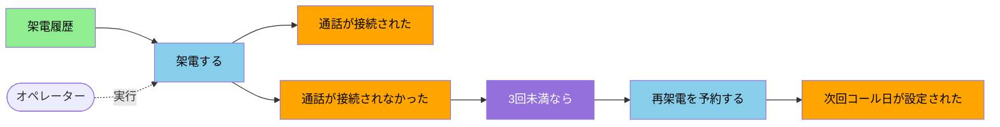

# 出力フォーマット

対話モデリング(モードA)・レビュー(モードB)の成果は、**構造化Markdown + Mermaid図**の両方で残す。Markdownは読み物・引き継ぎ用、Mermaidは因果と時系列の一望用。

保存先は相手の指定がなければ `02_AgentNote/` 配下を提案する(例:`02_AgentNote/event-storming-<対象プロセス名>.md`)。

## 構造化Markdownテンプレート

````markdown
# イベントストーミング:<対象プロセス名>

> 実施日 / 参加者 / 対象範囲(探求した業務プロセス)を簡潔に。

## サマリ
このプロセスで何が起きるか、1〜3文で。

## タイムライン(業務イベント)
正常系を上から時系列に。代替系は分岐として示す。

1. 通話が接続された
2. 用件がヒアリングされた
3. (分岐)通話が接続されなかった → 次回コール日が設定された

## コマンドとアクター
| コマンド | アクター | 生成するイベント |
|---|---|---|
| 架電する | オペレーター | 通話が接続された / 通話が接続されなかった |

## ポリシー(自動化ルール)
| 起点イベント | 条件 | 実行コマンド |
|---|---|---|
| 通話が接続されなかった | 3回未満 | 再架電を予約する |

## 読み取りモデル
| 名前 | 使うアクター | 用途 |
|---|---|---|
| 架電履歴 | オペレーター | 次の架電可否を判断 |

## 外部システム
| システム | 入力(呼ぶコマンド) | 出力(受けるイベント) |
|---|---|---|

## 集約
### Ticket
- 受けるコマンド:架電する、エスカレートする
- 生成するイベント:通話が接続された、チケットがエスカレートされた

## 区切られた文脈(候補)
- **架電管理コンテキスト**:Ticket集約、架電履歴
- 結合点:`次回コール日が設定された` を介して〇〇コンテキストと連携

## 問題点(Pain Points)
- ⬩ 運賃比較の業務知識が特定の担当に偏っている

## 用語(同じ言葉)
| 言葉 | 意味 | 備考 |
|---|---|---|
| 架電 | 顧客へ電話をかけること | 「コール」とも。現場は「架電」で統一 |
````

すべての項目が埋まる必要はない。回したステップの分だけ書く(ステップ1〜4までなら、タイムラインと問題点と用語だけでもよい)。

## Mermaid作図の約束

`flowchart LR`(左→右の時系列)を基本にする。要素ごとに `class` で色分けし、凡例に対応させる。

````markdown

````

作図の指針:
- **左→右**で時系列。コマンド→イベントの因果を実線、アクターの実行を点線(`-.実行.->`)で表す。
- 色は凡例(SKILL.md の表)に合わせる:イベント=オレンジ、コマンド=水色、ポリシー=紫、読み取りモデル=緑、外部システム=ピンク、集約=黄。
- 集約や区切られた文脈は `subgraph` で囲って境界を示してもよい。
- ノード数が多いときは、転換イベントごとに図を分割する。
